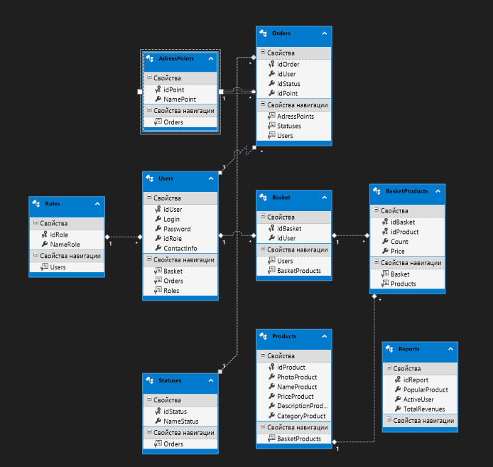

# OnlineStoreManagementSystem
# Описание
OnlineStoreManagementSystem - это WPF приложение для управления интернет-магазином, товарами и заказами.
Приложение поддерживает многопользовательский доступ с различными уровнями прав (администраторы, операторы, менеджеры) и предоставляет функцию онлайн заказа товара, а также генерации отчетов.
# Функциональность
1. Клиенты
* Зарегистрироваться и авторизоваться
* Выбрать из списка товаров нужный и добавить в корзину
* Сформировать заказ и выбрать доставку в любой удобный пункт выдачи
* Отследить доставку по трек-номеру
2. Администратор
* Добавить\Удалить\Редактировать товары, категории, клиентов, просматривать все отчеты
3. Менеджеры
* Просматривать информацию о клиентах, заказах, товарах, генерировать отчеты, усправлять статусами заказов
4. Операторы
* Обрабатывать заказы, вносить данные о доставке
5. Отчеты
* Популярный продукт
* Активный пользователь
* Общая выручка по месяцам
# Используемые технологии
* WPF - Windows Presentation Foundation для создания графического интерфейса.
* EntityFramework.6.2.0 - это набор технологий в ADO.NET, которые поддерживают разработку программных приложений, ориентированных на данные.
* MySql - База данных для хранения информации.
# База данных

# Структура базы данных
База данных MSSQL Server содержит следующие таблицы:
* Users - информация о пользователях
* Roles - роли пользователей
* AdressPoints - информация о пунктах выдачи товаров
* Orders - информация о заказах
* Basket - информация о корзине
* BasketProducts - товары в корзине
* Products - информация о товарах
* Statuses - статусы доставки
* Reports - отчеты
